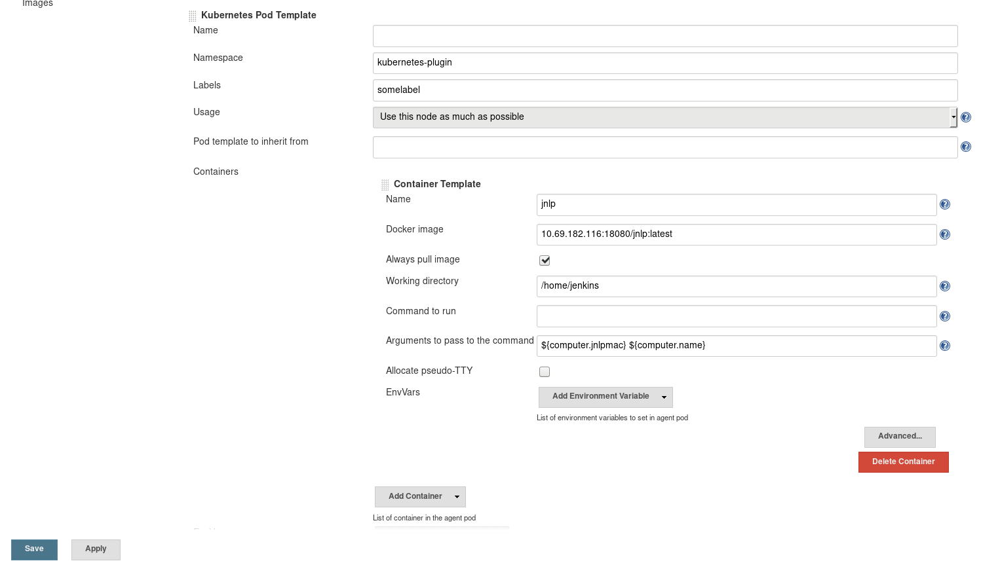

1. Step one is to install DOCKER
https://kubernetes.io/docs/setup/cri/

# Install Docker CE
## Set up the repository
### Install required packages.
    yum install yum-utils device-mapper-persistent-data lvm2

### Add docker repository.
yum-config-manager \
    --add-repo \
    https://download.docker.com/linux/centos/docker-ce.repo

## Install docker ce.
yum update && yum install docker-ce-18.06.1.ce

## Create /etc/docker directory.
mkdir /etc/docker

# Setup daemon.
cat > /etc/docker/daemon.json <<EOF
{
  "exec-opts": ["native.cgroupdriver=systemd"],
  "log-driver": "json-file",
  "log-opts": {
    "max-size": "100m"
  },
  "storage-driver": "overlay2",
  "storage-opts": [
    "overlay2.override_kernel_check=true"
  ]
}
EOF

mkdir -p /etc/systemd/system/docker.service.d

# Restart docker.
systemctl daemon-reload
systemctl restart docker
systemctl enable docker.service
systemctl stop firewalld
systemctl disable firewalld

2. Install kubeadmin
https://kubernetes.io/docs/setup/independent/install-kubeadm/
cat <<EOF > /etc/yum.repos.d/kubernetes.repo
[kubernetes]
name=Kubernetes
baseurl=https://packages.cloud.google.com/yum/repos/kubernetes-el7-x86_64
enabled=1
gpgcheck=1
repo_gpgcheck=1
gpgkey=https://packages.cloud.google.com/yum/doc/yum-key.gpg https://packages.cloud.google.com/yum/doc/rpm-package-key.gpg
exclude=kube*
EOF

# Set SELinux in permissive mode (effectively disabling it)
setenforce 0
sed -i 's/^SELINUX=enforcing$/SELINUX=permissive/' /etc/selinux/config

yum install -y kubelet kubeadm kubectl --disableexcludes=kubernetes

systemctl enable kubelet && systemctl start kubelet

+ 
Optionally:
cat <<EOF >  /etc/sysctl.d/k8s.conf
net.bridge.bridge-nf-call-ip6tables = 1
net.bridge.bridge-nf-call-iptables = 1
EOF
sysctl --system

********  For all machines!!:        ****************

#free -h
#blkid
#lsblk
sudo swapoff /dev/mapper/cl-swap (TBD: To be added on ssh initiation)
#sudo swapoff -a 

create a sudo user(for example dimo):
useradd dimo
passwd dimo
usermod -aG wheel dimo
su dimo

sudo hostnamectl set-hostname master/node1/node2/...

******** On the kubernetes master:   *****************
sudo kubeadm config images pull (optional)

3. Kube admin init + applying flannel overway network + joining nodes
https://kubernetes.io/docs/setup/independent/create-cluster-kubeadm/

sudo kubeadm init --pod-network-cidr=10.244.0.0/16 --apiserver-advertise-address=10.69.182.123

Right away after that do:(or in case of "The connection to the server localhost:8080 was refused - did you specify the right host or port?" error)
su TheSudoUserThatYouCreated

mkdir -p $HOME/.kube
sudo cp /etc/kubernetes/admin.conf $HOME/
sudo chown $(id -u):$(id -g) $HOME/admin.conf
export KUBECONFIG=$HOME/admin.conf(TBD: To be added on ssh initiation)

kubectl apply -f https://raw.githubusercontent.com/coreos/flannel/master/Documentation/kube-flannel.yml

NOTE: Wait for ALL pods to be in running state before joining nodes!!!:
kubectl get pods --all-namespaces

********* On each of the Nodes execute the join command:

sudo kubeadm join 10.69.182.123:6443 --token ofvkm1.7kt9jhorh05902n5 --discovery-token-ca-cert-hash sha256:0d441ed79293e90fa3c2b2ca3028c31d341a8615d23b7d4376c15fd4bb4e2384

On the master node create the kubernetes-plugin namespace:
kubectl create namespace kubernetes-plugin TBD: To research that step further
Sets a context entry in kubeconfig: TBD: To research that step further
kubectl config set-context $(kubectl config current-context) --namespace=kubernetes-plugin

3.1 In case you need to rest the cluster
On the master and all of the nodes do:
sudo kubeadm reset

3.2 Usefull commands
If you want to list all nodes:

kubectl get nodes
kubectl get pods -o wide --all-namespaces
kubectl describe pod coredns-86c58d9df4-dxl5l -n kube-system

Note:
in case of "Unable to connect to the server: x509..." error add:  --insecure-skip-tls-verify="true" to the list of params

4. Configuring Certificates for Jenkins Kubernetes Plugin 0.12
https://illya-chekrygin.com/2017/08/26/configuring-certificates-for-jenkins-kubernetes-plugin-0-12/

echo | cat $HOME/admin.conf | grep -Po "(?<=certificate-authority-data:\s)[^\s]*" | base64 -d > ca.crt
echo | cat $HOME/admin.conf | grep -Po "(?<=client-certificate-data:\s)[^\s]*" | base64 -d > client.crt
echo | cat $HOME/admin.conf | grep -Po "(?<=client-key-data:\s)[^\s]*" | base64 -d > client.key
openssl pkcs12 -export -out cert.pfx -inkey client.key -in client.crt -certfile ca.crt -passout pass:aaaaa

5. Add usecure registry and dns list to docker on master + all nodes(steps may vary in case of Debian destribution)
sudo vi /etc/docker/daemon.json

{
  .........
  ..........
  ...........
  .............
  ,
  "insecure-registries": ["10.69.182.116:18080"],
  "dns": ["10.69.177.102", "10.69.177.253"]
}

6. Pull an Image from a Private Registry
https://kubernetes.io/docs/tasks/configure-pod-container/pull-image-private-registry/

docker login 10.69.182.116:18080

kubectl create secret docker-registry regcred --docker-server=10.69.182.116:18080 --docker-username=admin --docker-password='admin123' --docker-email='grigorov@ifao.net' --namespace=kubernetes-plugin

to make sure everything up correct follow the "Create a Pod that uses your Secret" steps

7. Add configuration to every pipeline similar to that:
templatePod entirely defined in the Pipeline like:
def label = "mypod-${UUID.randomUUID().toString()}"
podTemplate(label: label, cloud: 'kubernetes', namespace: 'kubernetes-plugin',
    containers: [containerTemplate(name: 'jnlp', workingDir: '/home/jenkins', image: '10.69.182.116:18080/jnlp:latest', args: '${computer.jnlpmac} ${computer.name}')], imagePullSecrets: [ 'regcred' ]){
    node(label) {
        stage('Run GIT Cloning') {
            container('jnlp') {    
                sh 'echo hello'
            }
            
        }
    }
}

or predifined in the ui podTemplate with label 'somelabel':

podTemplate(label: 'somelabel') {
  node('somelabel') {
    stage('Run specific shell') {
      container('jnlp') {    
        sh 'echo hello'
      }
    }
  }
}
 

